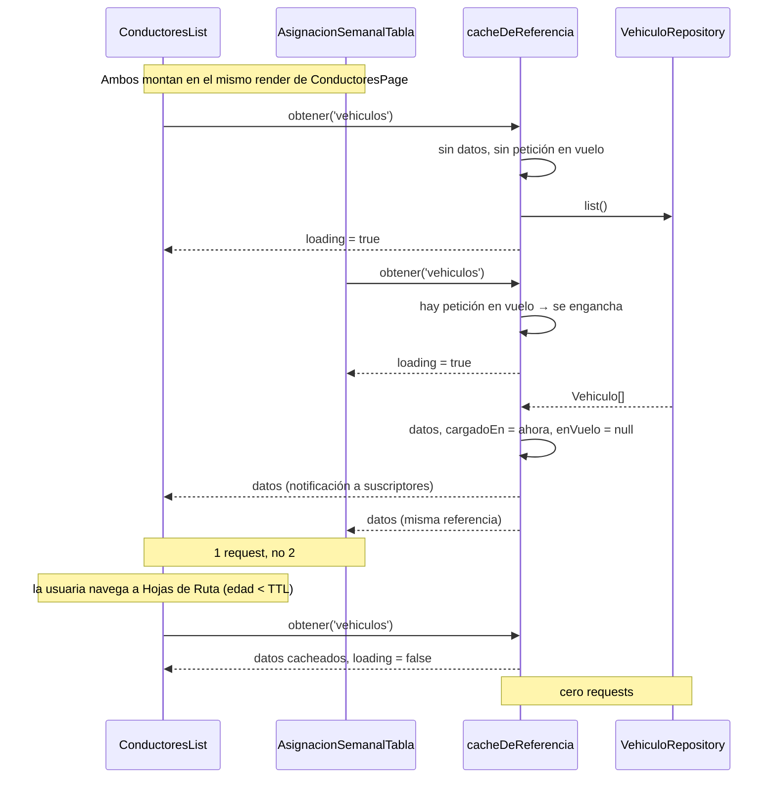

## Context

Motivación y evidencia: ver `proposal.md` §Why. Requisitos observables: ver
`specs/cache-listas-referencia/spec.md`. Acá va solo lo que condiciona **cómo** se implementa.

Restricciones reales del código, verificadas (2026-08-12):

1. **Los cuatro hooks son el mismo archivo con otro tipo.** `usePacientes.ts` (74 líneas),
   `useConductores.ts` (74), `useVehiculos.ts` (74) y `useObrasSociales.ts` (75) son idénticos salvo
   los tipos: `useState` de datos/`loading`/`error`, un `cargar` en `useCallback` que hace
   `repository.list()`, un `useEffect` que lo dispara, y `crear`/`actualizar` que llaman a `cargar()`
   después de mutar. Esa uniformidad es lo que hace viable un único primitivo compartido.
2. **Los repositories son singletons de módulo.** Cada `*Route.tsx` importa `supabaseXRepository` (o
   el mock) y lo inyecta por Context. En runtime hay **exactamente una instancia por dominio**, lo
   que habilita una clave de caché por dominio y no por instancia.
3. **`paginacion-listados` ya separó las dos poblaciones.** `PacientesPage` usa
   `usePacientesPaginado` (→ `listPage`); `usePacientes` (→ `list()`) sobrevive **solo** para los
   selectores de `PresupuestosPage`/`FacturacionPage`/`HojaDeRutaPage`. Es decir: `list()` ya es,
   hoy, "el padrón completo casi estático". No hay que separar nada, ya está separado.
4. **React 19 + `tsc -b --noEmit` + strict, sin `any`.** El store debe ser genérico y tipado; lectura
   desde React vía `useSyncExternalStore` para no romper bajo render concurrente.
5. **247 archivos de test; 115 usan `render` pelado** (solo 10 usan `renderConSesion`). Cualquier
   solución que exija un provider nuevo obliga a tocar los archivos que montan estas pantallas: 26
   verificados por `grep`. Este número decide D1 en parte.

## Goals / Non-Goals

**Goals:**

- Un **único** primitivo de caché, genérico y con tests propios, en vez de cuatro implementaciones.
- Que la migración sea **invisible** para pantallas y componentes: la forma del resultado de cada
  hook no cambia, así que ningún `*Page.tsx`, `*List.tsx`, `*Form.tsx`, `*Route.tsx` ni
  `*RepositoryContext.tsx` se toca.
- Corrección bajo React 19 concurrente: sin *tearing*, sin `setState` sobre componentes
  desmontados, sin fugas de suscripción.
- Determinismo en tests: estado global reseteado, conteos de llamadas predecibles.
- Dejar la puerta abierta a TanStack Query sin rehacer nada, si el proyecto crece hacia ahí.

**Non-Goals:**

- No es una capa de caché general para toda la app. Es para cuatro claves fijas.
- No hay normalización por entidad, ni actualizaciones optimistas, ni caché de mutaciones.
- No hay persistencia, refetch-on-focus, reintentos con backoff ni sincronización entre pestañas.
- No se optimiza el LCP de carga fría (fuera de alcance, ver `proposal.md` §Why).

## Decisions

### D1 — Primitivo propio en vez de `@tanstack/react-query` ⚠️ CHECKPOINT

**Decisión: implementar `useListaCacheada` en el proyecto. Requiere OK explícito de la usuaria
antes del apply, porque la consulta original fue específicamente sobre React Query.**

| Criterio | `@tanstack/react-query` | Primitivo propio |
|---|---|---|
| Resuelve el problema | ✅ De sobra | ✅ Exactamente |
| Peso en el bundle | ~13 KB gzip en el critical path | ~1 KB |
| Efecto sobre el LCP que originó la consulta | Lo empeora, marginalmente | Neutro |
| Provider obligatorio | Sí (`QueryClientProvider`) en `App.tsx` **y en cada test que monte estos hooks** (26 archivos) | No |
| Superficie de código propio a mantener | ~10 líneas de wiring | ~120 líneas + sus tests |
| Riesgo de implementar mal la concurrencia | Nulo | Real — mitigado en D2 y con TDD estricto |
| Funcionalidad que quedaría sin usar | Paginación, infinite, optimistic, devtools, retry, focus, offline, prefetch, suspense | — |
| Precedente del proyecto | Contradice `paginacion-listados` §7 ("cero dependencias nuevas") | Lo respeta |

**Por qué el propio gana acá y no en general:** la necesidad es de **cuatro claves fijas, sin
parámetros, sin paginación y sin updates optimistas**. Es el caso más simple posible de una
librería cuyo valor está en los casos complejos. Y el argumento decisivo es de contexto: la consulta
nació de un LCP pobre — agregar 13 KB al critical path para mejorar la navegación es un
intercambio que la usuaria merece hacer conscientemente, no por defecto.

**Alternativas consideradas y descartadas:**

- **SWR** (~4 KB): más liviana que TanStack, misma idea. Sigue exigiendo cambios en los consumidores
  (su API es `useSWR(key, fetcher)`) y sigue siendo una dependencia para cuatro claves.
- **Zustand / Jotai como store de caché**: agrega un modelo de estado global al proyecto, que hoy no
  tiene ninguno. Desproporcionado.
- **Subir el estado a un Context de app** (`<ListasDeReferenciaProvider>` en `App.tsx`): no requiere
  librería, pero obliga a envolver los 26 archivos de test igual que TanStack, y provoca re-render
  de **todos** los consumidores ante cualquier cambio de cualquier lista (un Context = un valor).

**Gatillo de migración documentado** (esto no es "nunca", es "todavía no"): si aparece **cualquiera**
de estos, TanStack Query pasa a estar justificada y se migra —
(a) necesidad de cachear resultados paginados/filtrados, (b) updates optimistas,
(c) scroll infinito, (d) modo offline o persistencia, (e) más de ~8 dominios cacheados,
(f) sincronización entre pestañas. Por D7, la migración se hace dentro de `useListaCacheada.ts` sin
tocar ningún consumidor.

### D2 — Store de módulo + `useSyncExternalStore`, no estado de React

**Decisión:** el estado vive en un módulo plano (`cacheDeReferencia.ts`), sin React; los hooks se
suscriben con `useSyncExternalStore`.

Razones:

- **Sobrevive al desmontaje.** Es el requisito central: react-router desmonta la ruta, y cualquier
  estado dentro del árbol de React se va con ella. El estado tiene que estar **afuera**.
- **`useSyncExternalStore` es la API oficial de React 18/19 para exactamente esto** y garantiza
  ausencia de *tearing* bajo render concurrente. Escribir el mismo patrón a mano con
  `useState` + un event emitter es donde aparecen los bugs sutiles.
- **Sin provider** → no se toca `App.tsx` ni ningún test de render (ver D1).

Forma de cada entrada, tipada y sin `any`:

```ts
interface EntradaCache<T> {
  datos: readonly T[] | null;   // null = nunca se cargó
  cargadoEn: number | null;     // epoch ms del último éxito
  enVuelo: Promise<readonly T[]> | null;
  error: string | null;
}
```

**Detalle crítico de `useSyncExternalStore`: el snapshot debe ser referencialmente estable.** Si
`getSnapshot()` construye un objeto nuevo en cada llamada, React entra en bucle infinito de render.
Por eso el store guarda **el objeto `EntradaCache` mismo** y lo reemplaza solo cuando algo cambia de
verdad; `getSnapshot()` devuelve esa referencia tal cual. Es la trampa número uno de esta API y va
con test propio.

**Alternativa descartada:** un módulo con un `Map` mutable leído directamente desde los hooks, sin
suscripción. Funciona para la primera carga, pero un componente ya montado no se enteraría de que
otro invalidó la clave. La suscripción no es opcional.

### D3 — Frescura: cache-first con TTL de 5 minutos + revalidación en background

**Decisión:** `TTL_LISTAS_REFERENCIA = 5 * 60 * 1000`, una constante única y exportada.

Máquina de estados al solicitar un dominio:

| Estado de la entrada | Qué se devuelve | ¿Se consulta al servidor? | `loading` |
|---|---|---|---|
| Sin datos, sin petición en vuelo | — | Sí | `true` |
| Sin datos, con petición en vuelo | — | No (se engancha) | `true` |
| Con datos, edad < TTL | datos cacheados | **No** | `false` |
| Con datos, edad ≥ TTL | datos cacheados | Sí, en background | `false` |
| Con datos + error de revalidación | datos cacheados + `error` | — | `false` |



**Por qué 5 minutos y no infinito:** con TTL infinito, un alta hecha por otra usuaria (o en otra
pestaña) no se vería **nunca** en esta sesión. Es una app multiusuaria de operación diaria: 5
minutos acota la ventana de desactualización a algo defendible y sigue eliminando la abrumadora
mayoría de los re-fetch (una sesión de trabajo navega entre pantallas cada pocos segundos, no cada
5 minutos). Si en producción se ve que molesta hacia un lado u otro, es **una constante**.

**Por qué revalidar en background y no mostrar spinner:** una pantalla que ya tiene contenido y lo
reemplaza por un spinner al reentrar se siente *más* lenta que antes del cambio, aunque haga menos
trabajo. El requisito "sin parpadeo" está en el spec, no es un detalle de implementación.

**Alternativa descartada:** invalidación puramente por eventos (sin TTL). Es más "puro" pero depende
de que **todos** los caminos de mutación estén cableados para siempre — incluidos los que escriba
alguien en seis meses. El TTL es la red de seguridad para cuando ese cableado falle (y va a fallar:
ver R1).

### D4 — La invalidación vive en los hooks, no en un decorador de repository

**Decisión:** `crear`/`actualizar` de cada hook invalidan su clave antes de recargar.

**Alternativa seriamente considerada: un decorador `conCacheDeLista(repository, clave)`** aplicado en
cada `*Route.tsx`, que invalidara desde dentro de `create`/`update`/`delete`. Es **más robusto**
—atrapa cualquier camino de mutación, incluso los futuros— pero:

- En TypeScript strict, decorar cuatro interfaces distintas significa escribir a mano el
  *passthrough* de todos sus métodos (`PacienteRepository` sola tiene `list`, `listPage`, `get`,
  `create`, `update`, direcciones, personas a cargo…). Es mucho código ceremonial y frágil: un
  método nuevo que alguien olvide reenviar rompe en runtime, no en compilación.
- Mete la caché **en el composition root**, contradiciendo el criterio del proyecto de que
  `*Route.tsx` solo conoce "qué implementación se inyecta", nunca cómo se consume.

**Se elige la opción simple y visible, y se compensa el riesgo por otras dos vías:** el TTL de D3
como red de seguridad temporal, y el requisito de spec "toda mutación invalida" con test explícito
del camino paginado. **Si el proyecto suma más caminos de mutación (import masivo, acciones en
lote), reevaluar el decorador.**

### D5 — Clave por dominio, no por instancia de repository

**Decisión:** cuatro claves literales (`'pacientes' | 'vehiculos' | 'conductores' | 'obrasSociales'`)
como *union type*, no `string`.

La clave **no** deriva de la instancia del repository. Justificación: en runtime hay un singleton por
dominio (ver Context §2), así que instancia y dominio son biyectivos. Derivar la clave de la
instancia (con un `WeakMap`) sería más "correcto" pero rompería el caso que más importa: dos
consumidores del **mismo** dominio deben compartir caché aunque reciban el repository por vías
distintas (uno por Context, otro por prop) — que es literalmente el caso de `useVehiculos` en
`ConductoresList` (Context) vs. `AsignacionSemanalTabla` (prop).

El *union type* en vez de `string` hace que un typo sea un error de compilación bajo
`tsc -b --noEmit`, no un cache miss silencioso.

**Consecuencia asumida (R5):** si algún día conviven dos repositories del mismo dominio (mock y
Supabase a la vez), comparten clave. Hoy no pasa en producción; en tests lo cubre el reset global.

### D6 — Los tres hooks del dashboard también pasan por la caché

`useAlertasCud`, `useAlertasMantenimiento` y `useConductoresDashboard` llaman `repository.list()`
directo, sin pasar por los hooks de feature. **Entran al alcance**, por dos razones:

- `/` es la **ruta índice**: es la pantalla que más se monta en una sesión, y hoy paga tres `list()`
  completos en cada montaje.
- Son de **solo lectura y sin filtros** — comparten exactamente la misma consulta y por lo tanto la
  misma clave. Incluirlos es casi gratis y duplica el beneficio: visitar Vehículos y después el
  dashboard pasa a costar un request en vez de dos.

Su forma pública tampoco cambia; solo se reemplaza el `list()` interno por la lectura cacheada.

### D7 — La API de `useListaCacheada` se moldea para ser reemplazable por TanStack Query

Firma deliberadamente isomorfa a `useQuery`:

```ts
useListaCacheada<T>({ clave, cargar, ttlMs? })
  → { datos: readonly T[]; loading: boolean; error: string | null; recargar: () => Promise<void> }
```

`clave` ≈ `queryKey`, `cargar` ≈ `queryFn`, `ttlMs` ≈ `staleTime`, `recargar` ≈ `refetch`,
`invalidar(clave)` ≈ `queryClient.invalidateQueries`. Si se activa el gatillo de D1, la migración es
reescribir el cuerpo de **un** archivo (más agregar el provider); los cuatro hooks de feature y los
tres del dashboard no se enteran.

### D8 — Orden respecto de `paginacion-listados` ⚠️ decisión operativa

`paginacion-listados` está 61/93 y sus fases pendientes migran `ConductoresPage` y
`ObraSocialesPage` a `listPage`. Ambos changes escriben en `usePacientes.ts` y
`usePacientesPaginado.ts`.

**Decisión: este change se aplica DESPUÉS de que `paginacion-listados` cierre.** No es solo evitar
conflictos de merge: cada pantalla que paginación migre introduce un **camino de mutación nuevo**
(`crear`/`actualizar` sobre `listPage`) que debe invalidar la caché. Hacerlo al final significa
cablear un conjunto cerrado de caminos; hacerlo en paralelo significa perseguir un blanco móvil, y
un camino que se olvide falla **en silencio** (dato viejo en un selector), no con un error.

**Alternativa si hay urgencia:** aplicar solo la **Fase 1** (el primitivo `shared/lib/cache/` con sus
tests) — es código nuevo, no toca ningún archivo compartido, y no cambia comportamiento porque
todavía no tiene consumidores. Las fases 2-4 esperan.

### D9 — TDD estricto: el store primero, sin DOM

El orden de construcción sale del acoplamiento, no de la comodidad:

1. **`cacheDeReferencia.ts`** — módulo puro, sin React ni DOM. Toda la lógica difícil (dedup, TTL,
   invalidación, notificación a suscriptores, estabilidad de la referencia del snapshot) se testea
   acá con promesas controladas y reloj falso (`vi.useFakeTimers`). Es el único lugar donde puede
   haber bugs de concurrencia, y es 100% testeable sin montar nada.
2. **`useListaCacheada.ts`** — capa fina sobre el store; sus tests solo verifican el wiring de React
   (suscripción, limpieza al desmontar, no hay `setState` post-desmontaje).
3. **Los siete hooks consumidores** — sus tests existentes son el **safety net**: se corren primero
   para capturar la línea base, y el objetivo explícito es que sigan pasando (salvo los que asuman
   "un montaje = un `list()`", que se actualizan para asumir "un montaje = un `list()` **la primera
   vez**").

`limpiarCacheDeReferencia()` en un `beforeEach` global de `frontend/src/test/setup.ts` es **parte de
la Fase 1**, no un ajuste posterior: sin él, los tests de las fases siguientes fallan de forma
aleatoria según el orden de ejecución y se pierde media jornada persiguiendo un fantasma.

## Risks / Trade-offs

- **R1 — Un camino de mutación sin invalidar deja un selector desactualizado, en silencio (ALTO).**
  Es el riesgo principal: no rompe nada, no tira error, solo muestra datos viejos en pantallas
  sensibles (Facturación, Presupuestos). → **Mitigación:** (a) requisito de spec con escenario
  explícito para el camino paginado; (b) test dedicado que verifica que
  `usePacientesPaginado.crear/actualizar` invalida la clave `pacientes`; (c) el TTL de D3 acota
  cualquier fuga a 5 minutos; (d) D8 (aplicar después de paginación) cierra el conjunto de caminos.

- **R2 — Conflicto y blanco móvil con `paginacion-listados` (ALTO, coordinación).**
  → **Mitigación:** D8 — orden serializado, o apply parcial de la Fase 1 solamente.

- **R3 — Estado global filtrándose entre tests (MEDIO).** Con 247 archivos de test, un test que
  hereda caché ajena produce fallos intermitentes dependientes del orden — el peor tipo de fallo.
  → **Mitigación:** reset global en `setup.ts` desde la Fase 1 (D9), más un test que demuestre la
  fuga si se quita el reset.

- **R4 — Regresión de frescura frente a otra usuaria (MEDIO, aceptada).** Hoy, navegar de pantalla
  trae datos frescos siempre; con caché, hasta 5 minutos de retraso para ver el alta de otra
  persona. → **Mitigación:** TTL corto y configurable en un solo lugar; `recargar()` disponible como
  escape manual; toda mutación **propia** se ve al instante. Es un intercambio consciente, no un
  descuido — está en el spec.

- **R5 — Colisión de clave entre dos repositories del mismo dominio (BAJO).** → **Mitigación:** hoy
  hay un singleton por dominio; reset global cubre los tests. Si alguna vez conviven dos, la salida
  es una clave compuesta, sin cambiar la forma del store.

- **R6 — `useSyncExternalStore` mal usado ⇒ bucle infinito de render (MEDIO, técnico).** Si
  `getSnapshot()` devuelve un objeto nuevo cada vez, React re-renderiza sin fin. → **Mitigación:**
  el store guarda y devuelve la misma referencia de `EntradaCache` mientras nada cambie (D2), con
  test propio de estabilidad referencial. Es un error clásico y barato de prevenir, caro de
  diagnosticar.

- **R7 — Escribir caché en vez de instalarla (BAJO-MEDIO, estratégico).** 120 líneas propias son 120
  líneas que el proyecto mantiene. → **Mitigación:** alcance deliberadamente mínimo (cuatro claves,
  sin parámetros), cobertura por TDD estricto, y el gatillo de migración de D1 documentado para que
  la decisión se revise cuando el contexto cambie, no cuando duela.

- **Trade-off asumido:** este change **no** mejora el LCP de carga fría. Si esa sigue siendo la
  preocupación principal de la usuaria, el trabajo que corresponde es otro (code-splitting por ruta,
  análisis del bundle, imágenes, `preconnect` a Supabase) y merece su propio change.

## Migration Plan

Cuatro fases, cada una un commit independiente y reversible. Después de cada fase:
`npx tsc -b --noEmit` y `npm test` dentro de `frontend/`, ambos en verde.

1. **Fase 1 — Primitivo (código nuevo, cero consumidores, cero cambio de comportamiento).**
   `shared/lib/cache/{clavesCache,cacheDeReferencia,useListaCacheada}.ts` + tests, y el
   `beforeEach(limpiarCacheDeReferencia)` en `test/setup.ts`. Aplicable **incluso con
   `paginacion-listados` abierto** (D8).
2. **Fase 2 — Un solo dominio, de punta a punta: `obrasSociales`.** Es el de mayor relación
   beneficio/riesgo (4 pantallas lo piden, es el más estático, y su hook es el más simple). Sirve de
   validación del diseño completo —incluida la invalidación cruzada— antes de replicar. **Checkpoint
   de revisión humana acá.**
3. **Fase 3 — Los tres dominios restantes:** `vehiculos` (incluye el caso de dedup entre hermanos en
   `ConductoresPage`, con test propio), `conductores`, `pacientes` (incluye el cableado de
   invalidación en `usePacientesPaginado` — R1).
4. **Fase 4 — Los tres hooks del dashboard** (D6) y verificación final de la reducción de requests.

**Rollback:** ver `proposal.md` §Riesgo y rollback. Sin migración de datos, sin cambios de servidor,
sin cambios de API pública: revertir cualquier fase es `git revert` de su commit.

## Open Questions

Ninguna de estas altera el spec, el enfoque ni el desglose de tareas — todas son ajustes de
constante o trabajo posterior:

- **¿5 minutos es el TTL correcto para la operación real de Andrea?** Se puede decidir con la app
  andando; es una constante en un archivo.
- **¿Conviene mostrar un aviso sutil de "datos posiblemente desactualizados" cuando la revalidación
  falla?** El spec ya exige exponer el error junto con el dato cacheado; **si** se muestra y **cómo**
  es una decisión de UI, con `Alert` del design system, y se puede agregar después sin tocar la
  caché.
- **¿Vale la pena medir el antes/después?** Un conteo de requests por sesión (DevTools → Network,
  filtrando `rest/v1`) sobre un recorrido fijo daría el número real de mejora. Deseable, no
  bloqueante.
